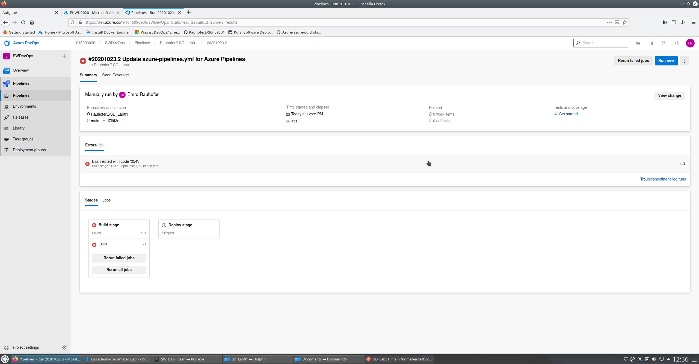
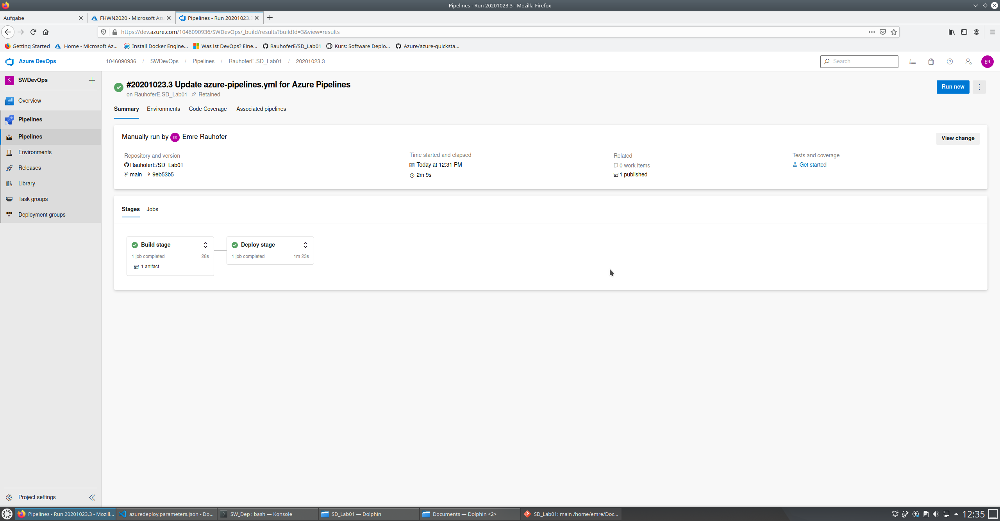
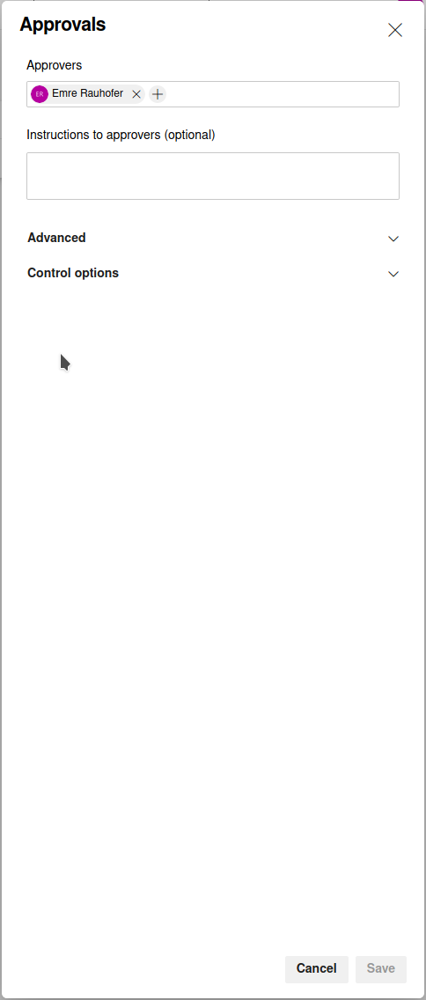
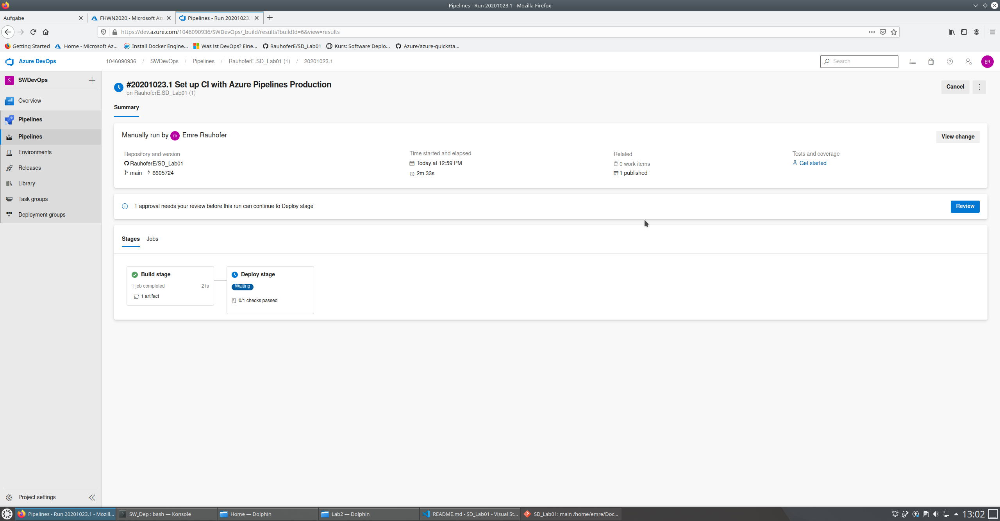
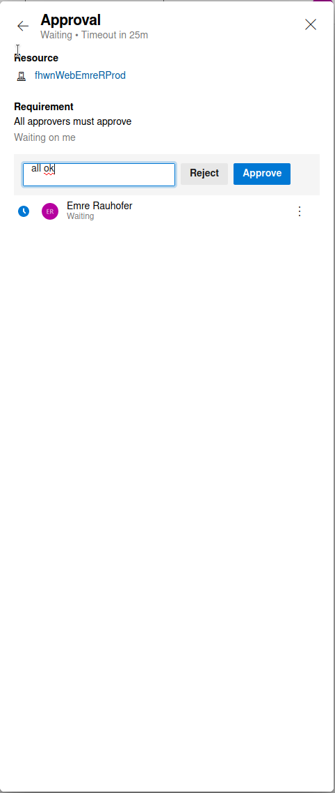

# Lab 2

## Links
Production Site = https://fhwnwebemrerprod.azurewebsites.net

## Build Fail

In the image above you can see that the build failed. The reason was that index file was in the wrong folder.

## Build Success

In the image above you can see that the build was successful.

## How to set approvals for release

First you have to create a new release pipeline in the pipeline window.
Then you simply go to Environments and click on you pipeline.
Then in the dropdown menu press Approvals and Checks.
Here you can add people that can approve the build for release.

Now you can create your own checks for release.

## How to approve the Release deployment

To approve the latest build for Production you have to go to the release pipeline and click on approve.

A side window will open in which you can write a small comment and finally approve the build for release.

