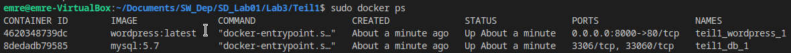

# Lab3
Für dieses Lab waren 2 Aufgaben geplant.

## Teil1
Bei Teil 1 geht es darum eine Wordpress Seite zu deployen, welche ein mysql image verwendet. Das wird gemacht durch den Command docker-compose.

1. Im ersten Schritt habe ich Compose installiert über diesen Link: https://docs.docker.com/compose/install/
2. Dann habe ich mithilfe von diesem Link: https://docs.docker.com/compose/wordpress/, die compose File gebaut.
3. Dann habe ich mit docker-compose up -d den Docker gebuildet.
4. Hier sieht man das sowhol wordpress als auch mysql in einem container laufen.

## Teil2
Bei Teil2 geht es darum zwei eigene images für msql und wordpress zu erstellen.

1. sudo docker pull debian:jessie um das image runterzuladen